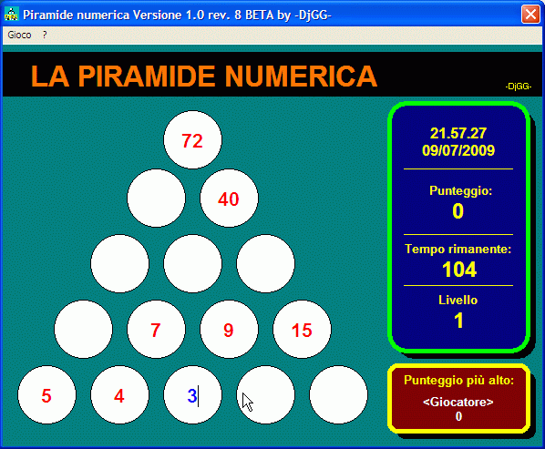



## Piramide Numerica

### Description

Questa piramide &#232; un divertente gioco, composto da 15 caselle distribuite su 5 linee. Lo scopo &#232; quello di calcolare la somma dei 2 numeri che si trovano nelle 2 caselle sottostanti. Le nuove piramidi proposte verranno create casualmente dal software.

This pyramid is a funny game made by 15 boxes distributed on 5 lines. The goal is calculate the add between the 2 numbers in 2 boxes underlying. The new pyramides are random made by the software.
 
### More Info
 

             |
---                |---
**Submitted On**   |2009-08-03 18:27:34
**By**             |[\-DjGG\- Solo software italiano](https://github.com/Planet-Source-Code/PSCIndex/blob/master/ByAuthor/djgg-solo-software-italiano.md)
**Level**          |Beginner
**User Rating**    |4.3 (13 globes from 3 users)
**Compatibility**  |VB 5\.0, VB 6\.0
**Category**       |[Games](https://github.com/Planet-Source-Code/PSCIndex/blob/master/ByCategory/games__1-38.md)
**World**          |[Visual Basic](https://github.com/Planet-Source-Code/PSCIndex/blob/master/ByWorld/visual-basic.md)
**Archive File**   |[Piramide\_N215946882009\.zip](https://github.com/Planet-Source-Code/djgg-solo-software-italiano-piramide-numerica__1-72341/archive/master.zip)

